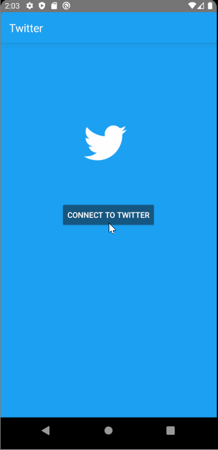

# Project 2 - *Twitter Client*

**Twitter Client** is an android app that allows a user to view his Twitter timeline. The app utilizes [Twitter REST API](https://dev.twitter.com/rest/public).

## User Stories

- User can **sign in to Twitter** using OAuth login
- User can **view tweets from their home timeline**
  - User is displayed the username, name, and body for each tweet
  - User is displayed the [relative timestamp](https://gist.github.com/nesquena/f786232f5ef72f6e10a7) for each tweet "8m", "7h"
- User can refresh tweets timeline by pulling down to refresh
- User can view more tweets as they scroll with infinite pagination
- Links in tweets are clickable and will launch the web browser
- User can tap a tweet to display a "detailed" view of that tweet
- User can see embedded image media within the tweet detail view
- User can watch embedded video within the tweet
- User can open the twitter app offline and see last loaded tweets
- User can **compose and post a new tweet**
  - User can click a “Compose” icon
  - User can then enter a new tweet and post this to twitter
  - User is taken back to home timeline with **new tweet visible** in timeline
  - Newly created tweet should be manually inserted into the timeline and not rely on a full refresh
  - User can **see a counter with total number of characters left for tweet** on compose tweet page
- User can **select "reply" from detail view to respond to a tweet**
- When a user leaves the compose view without publishing and there is existing text, prompt to save or delete the draft. If saved, the draft should then be **persisted to disk** and can later be resumed from the compose view.

## Video Walkthrough

Here's a walkthrough of implemented user stories:

GIF created with [LiceCap](http://www.cockos.com/licecap/).

## Open-source libraries used

- [Android Async HTTP](https://github.com/codepath/CPAsyncHttpClient) - Simple asynchronous HTTP requests with JSON parsing
- [Glide](https://github.com/bumptech/glide) - Image loading and caching library for Android
